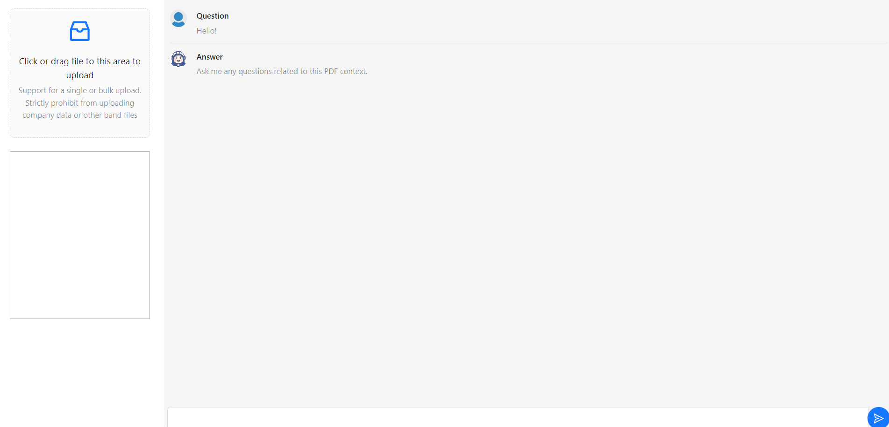

# Project Title

Chatbot Memo - Frontend

## Table of Content:

- [About The App](#about-the-app)
- [Screenshots](#screenshots)
- [Technologies](#technologies)
- [Setup](#setup)
- [Status](#status)

## About The App

Chatbot Memo - Frontend is a chatbot which helps users understand crypto with its custom knowledge

## Screenshots

## Technologies

`React`, `AntD`, `React Router Dom v6`, `React PDF Viewer`

## Setup

- download or clone the repository
- run `npm install` to setup necessary node_modules
- run `npm start`

## Status

Chatbot Memo - Frontend is completed.
